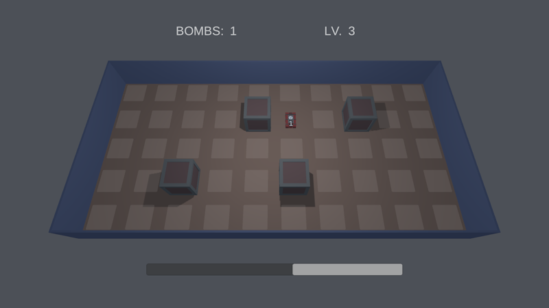

# BOMBSITE

<p align="center"></p>

## About

Bombsite is a **puzzle** game made in **~48h** during [Mini Jam 32: Explosions](https://itch.io/jam/mini-jam-32-explosions).  The main goal is to **"destroy"** all elements present on the level. The player can **place bombs** in highlighted places.  Bombs have a limited area of effect.  For each level, there is a **time limit**, after which the placed **bombs explode** one by one. The player has to progress through **10 levels** to beat the game.

You can **play in the browser** or **download for Windows** by clicking [here](https://m-biernat.itch.io/bombsite).

## Tools & Dependencies

 - [Unity 2018.2.12](https://unity.com/releases/editor/whats-new/2018.2.12) - game engine;
 - [Blender 2.79](https://www.blender.org/download/releases/2-79/) - to create 3D models;
 - Various online synthesizers and [Audacity](https://www.audacityteam.org/) to create BGM and SFX.

*The project requires Blender installed because of ```.blend``` files.*

## Credits

 - **Michał Biernat** @[m-biernat](https://github.com/m-biernat) - game designer, programmer, 3D artist and a "composer".

## License

All rights reserved ([no license](https://choosealicense.com/no-permission/)): 
 - You **can** view (peek into the code and assets) and fork this repository;
 - You **cannot** reproduce, distribute, or create derivative works;
 - You **can** play the game (*"BOMBSITE"*) free of charge via the provided channels.
